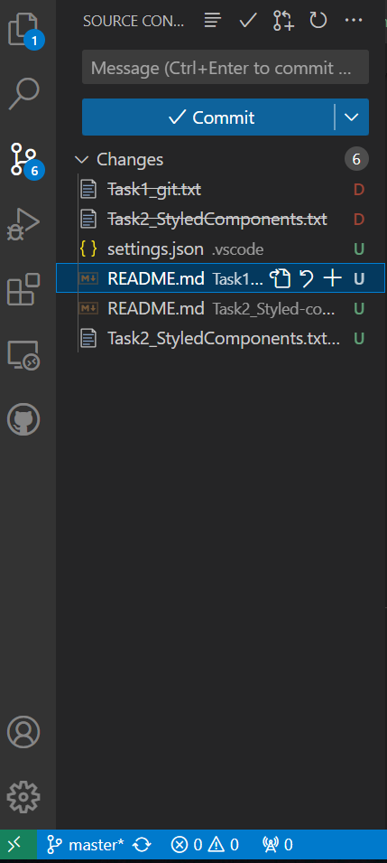

# Git/Github


## git config
    Usage: This command is used to config git.
    - git config –global user.name “[name]”
    - git config –global user.email “[email]”

Lệnh git config được sử dụng để cấu hình các tùy chọn trong Git. Bằng cách sử dụng git config, bạn có thể thiết lập và xem các tùy chọn cấu hình liên quan đến Git trên máy tính của bạn.

Dưới đây là một số ví dụ về cách sử dụng git config:

- Để xem tất cả các tùy chọn cấu hình hiện tại, bạn có thể sử dụng lệnh:

- Để xem một tùy chọn cấu hình cụ thể, bạn có thể sử dụng lệnh:
 ``` bash
git config user.name 
```
==> để xem tên người dùng hiện tại.

- Để thiết lập một tùy chọn cấu hình, bạn có thể sử dụng lệnh:
``` bash
git config user.email "example@example.com"
```
==> để thiết lập địa chỉ email người dùng.

- Để thiết lập một tùy chọn cấu hình toàn cục, bạn có thể sử dụng thêm tùy chọn --global:
vd: `git config --global user.name "Your Name"` để thiết lập tên người dùng toàn cầu.

- Để xóa một tùy chọn cấu hình, bạn có thể sử dụng lệnh:
vd: `git config --unset user.email` để xóa địa chỉ email người dùng.


## git init
    Usage: This command is used to start a new repository.
    - git init
Lệnh `git init` được sử dụng để khởi tạo một kho lưu trữ Git mới trong thư mục hiện tại. Khi bạn chạy `git init`, nó tạo ra một thư mục .git mới chứa tất cả các tệp và thư mục cần thiết để Git quản lý kho lưu trữ.

Việc sử dụng `git init` có thể được thực hiện trong các tình huống sau:

1. Tạo một kho lưu trữ Git mới cho dự án hiện tại: Bằng cách chạy `git init` trong thư mục gốc của dự án, bạn có thể bắt đầu sử dụng Git để theo dõi và quản lý phiên bản của dự án.

2. Khởi tạo một kho lưu trữ Git trống: Bạn có thể sử dụng `git init` để tạo một kho lưu trữ Git trống mà không liên kết với bất kỳ dự án cụ thể nào. Điều này có thể hữu ích khi bạn muốn bắt đầu theo dõi các tệp tin và thư mục bất kỳ trên máy tính của mình.

3. Khởi tạo một kho lưu trữ Git trong một thư mục đã tồn tại: Nếu bạn đã có một thư mục chứa các tệp tin và thư mục và muốn bắt đầu sử dụng Git để quản lý phiên bản của chúng, bạn có thể chạy `git init` trong thư mục đó để tạo một kho lưu trữ Git mới.

Sau khi chạy `git init`, bạn có thể sử dụng các lệnh Git khác như `git add, git commit, và git push` để quản lý và tương tác với kho lưu trữ Git của bạn.

## git clone
    Usage: This command is used to obtain a repository from an existing URL.
    - git clone [url]

Lệnh `git clone` được sử dụng để sao chép (clone) một kho lưu trữ Git từ một kho lưu trữ từ xa (remote repository) vào máy tính của bạn. Khi bạn chạy `git clone`, nó tạo ra một bản sao hoàn chỉnh của kho lưu trữ từ xa, bao gồm tất cả các lịch sử commit, nhánh và tệp tin.

Đây là cú pháp cơ bản của lệnh `git clone`:

```bash
git clone <remote_repository_url> [<local_directory_name>]
```
- `<remote_repository_url>` là địa chỉ URL của kho lưu trữ từ xa mà bạn muốn sao chép. Điều này có thể là một đường dẫn HTTP(S) hoặc SSH đến kho lưu trữ trên một máy chủ từ xa.
- `<local_directory_name> `(tùy chọn) là tên thư mục mà bạn muốn sử dụng cho kho lưu trữ sao chép trên máy tính của bạn. Nếu không được chỉ định, Git sẽ tạo một thư mục mới với tên của kho lưu trữ từ xa.


## git add
    Usage: This command adds a file to the staging area.  
    - git add [file] 
Lệnh `git add` được sử dụng để thêm các thay đổi hoặc tệp tin mới vào vùng chờ (`staging area`) trong Git. Vùng chờ là nơi bạn chuẩn bị các thay đổi trước khi `commit` chúng vào kho lưu trữ.

Dưới đây là một số mục đích chính của lệnh `git add`:

1. Thêm các thay đổi vào vùng chờ:
    ```bash
   git add .
   ```

2. Thêm tệp tin mới vào vùng chờ: 
     ```bash
   git add [file]
   ```


## git commit
    Usage: This command records or snapshots the file permanently in the version history.
    - git commit -m “[ Type in the commit message]”
Trong Git, `git commit` là một lệnh được sử dụng để tạo một commit mới trong repository của bạn. Một commit trong Git đại diện cho một bản ghi của các thay đổi được thực hiện trên repository của bạn.

Khi bạn thực hiện một commit, bạn đang lưu trữ một tập hợp các thay đổi mới hoặc sửa đổi vào lịch sử của repository. Mỗi commit có một thông điệp kèm theo để mô tả những thay đổi đã được thực hiện trong commit đó.
```bash
git commit -m “[ Type in the commit message]”
```

Cú pháp cơ bản của lệnh `git commit` là:
Trong đó:
- `-m` là một tùy chọn để chỉ định thông điệp của commit.
- `"commit message"` là thông điệp mô tả các thay đổi trong commit.


## git diff
    Usage: This command shows the file differences which are not yet staged.
    - git diff –staged
Trong Git, `git diff` là một lệnh được sử dụng để xem sự khác biệt giữa các thay đổi trong working directory và staging area, hoặc giữa các commit trong repository.

Khi bạn thực hiện lệnh git diff mà không có tham số, Git sẽ hiển thị sự khác biệt giữa `working directory` và `staging area`. Điều này cho phép bạn xem các thay đổi chưa được thêm vào `staging area`.

Ngoài ra, bạn cũng có thể sử dụng git diff với các tham số để so sánh sự khác biệt giữa các commit trong repository. Ví dụ, `git diff commit1 commit2 `sẽ hiển thị sự khác biệt giữa hai commit được chỉ định.


## git reset
    Usage: This command unstages the file, but it preserves the file contents.
    - git reset [file]
Lệnh git reset trong Git được sử dụng để thay đổi trạng thái của repository của bạn bằng cách di chuyển HEAD và nhánh hiện tại đến một commit cụ thể hoặc bỏ qua các thay đổi đã được staged.

Có ba dạng cơ bản của lệnh git reset:

1. Soft reset: `git reset --soft <commit>` di chuyển HEAD đến commit được chỉ định và giữ các thay đổi đã được staged. Điều này cho phép bạn thay đổi lại commit trước đó và chuẩn bị commit lại với các thay đổi mới.

2. Mixed reset (mặc định): `git reset <commit> `di chuyển HEAD đến commit được chỉ định và hủy bỏ các thay đổi đã được staged. Các thay đổi vẫn còn trong thư mục làm việc của bạn và bạn có thể sử dụng git add để staged lại các thay đổi mong muốn.

3. Hard reset: `git reset --hard <commit>` di chuyển HEAD đến commit được chỉ định và xóa mọi thay đổi đã được staged và cả các thay đổi trong thư mục làm việc. Các thay đổi sẽ bị mất và không thể khôi phục lại.


## git status
    Usage: This command lists all the files that have to be committed.
    - git status
Lệnh `git status` trong Git được sử dụng để hiển thị trạng thái hiện tại của repository của bạn. Khi bạn chạy lệnh `git status`, Git sẽ cung cấp thông tin về các tệp tin đã được thay đổi, đã được thêm hoặc đã bị xóa, cũng như nhánh hiện tại bạn đang làm việc trên.

Kết quả của git status bao gồm các thông tin sau:

- `On branch`: Dòng này cho biết tên của nhánh hiện tại mà bạn đang làm việc.
- `Changes not staged for commit`: Phần này liệt kê các tệp tin đã được thay đổi hoặc xóa mà chưa được đưa vào trạng thái staged để commit.
- `Changes to be committed`: Phần này liệt kê các tệp tin mới hoặc đã được thay đổi và đã được đưa vào trạng thái staged để commit.
- `Untracked files`: Phần này liệt kê các tệp tin trong thư mục làm việc của bạn mà Git chưa theo dõi.

Ngoài ra, git status cũng có thể cung cấp thông tin hoặc gợi ý khác dựa trên trạng thái của repository của bạn, chẳng hạn như hướng dẫn về cách đưa các thay đổi vào trạng thái staged hoặc hủy bỏ các thay đổi.


## git rm
    Usage: This command deletes the file from your working directory and stages the deletion.
    - git rm [file]
Lệnh `git rm` trong Git được sử dụng để xóa một tệp tin hoặc thư mục khỏi repository của bạn. Khi bạn chạy lệnh `git rm`, Git sẽ xóa tệp tin hoặc thư mục được chỉ định và ghi lại thay đổi này trong lịch sử commit.

Cú pháp cơ bản của lệnh git rm là:
hoặc

- <file>: Tên của tệp tin bạn muốn xóa.
- <directory>: Tên của thư mục bạn muốn xóa. Sử dụng tùy chọn -r để xóa thư mục và nội dung bên trong.

Lưu ý rằng khi bạn chạy lệnh git rm, tệp tin hoặc thư mục sẽ bị xóa khỏi thư mục làm việc của bạn và không còn tồn tại trong repository. 


## git log
    Usage: This command is used to list the version history for the current branch.
    - git log
Lệnh `git log` trong Git được sử dụng để xem lịch sử commit của repository. Khi bạn chạy lệnh `git log`, Git sẽ hiển thị danh sách các commit được thực hiện trong repository theo thứ tự từ mới nhất đến cũ hơn.

Cú pháp cơ bản của lệnh `git log` là:

Khi bạn chạy lệnh này, Git sẽ hiển thị các thông tin về mỗi commit, bao gồm:
- `Commit hash`: Mã hash duy nhất của commit.
- `Tác giả`: Tên và địa chỉ email của người thực hiện commit.
- `Ngày và giờ`: Thời điểm commit được thực hiện.
- `Message`: Nội dung thông điệp của commit, mô tả các thay đổi hoặc tính năng được thêm vào.

Lệnh git log cung cấp một số tùy chọn để tùy chỉnh hiển thị lịch sử commit, ví dụ:
- `--oneline`: Hiển thị mỗi commit trên một dòng, chỉ bao gồm commit hash và thông điệp.
- `--author`: Lọc các commit dựa trên tác giả.
- `--since và --until`: Lọc các commit dựa trên khoảng thời gian.

## git branch
    Usage: This command lists all the local branches in the current repository.
    - git branch
Lệnh `git branch` trong Git được sử dụng để xem, tạo và xóa các nhánh (branches) trong repository của bạn.

Có một số cách sử dụng lệnh `git branch`:

1. Xem danh sách các nhánh: Bằng cách chạy lệnh git branch mà không có tham số, Git sẽ hiển thị danh sách tất cả các nhánh trong repository của bạn. 

2. Tạo nhánh mới: Bằng cách sử dụng git branch với tên của nhánh, bạn có thể tạo một nhánh mới từ nhánh hiện tại. Nhánh mới sẽ chứa toàn bộ lịch sử và các commit từ nhánh gốc.


3. Xóa nhánh: Bằng cách sử dụng `git branch với tùy chọn -d` và tên của nhánh, bạn có thể xóa một nhánh đã tồn tại. Lưu ý rằng bạn không thể xóa nhánh hiện tại hoặc nhánh chưa được hợp nhất (unmerged).


## git checkout
    Usage: This command is used to switch from one branch to another.
    - git checkout [branch name]
Lệnh `git checkout` trong Git được sử dụng để chuyển đổi (checkout) giữa các nhánh (branches) hoặc khôi phục các tệp tin từ commit trước đó.

Có hai cách chính để sử dụng lệnh `git checkout`:

1. Chuyển đổi giữa các nhánh: Bằng cách sử dụng `git checkout` với tên của nhánh, bạn có thể chuyển đổi giữa các nhánh khác nhau trong repository của bạn. Khi bạn chuyển đổi sang một nhánh mới, Git sẽ cập nhật thư mục làm việc của bạn để phản ánh trạng thái của nhánh đó.

2. Khôi phục các tệp tin từ commit trước đó: Bằng cách sử dụng git checkout với tên của tệp tin hoặc đường dẫn của tệp tin, bạn có thể khôi phục các tệp tin từ commit trước đó. Điều này có thể hữu ích khi bạn muốn khôi phục lại phiên bản trước đó của một tệp tin cụ thể.


## git remote
    Usage: This command is used to connect your local repository to the remote server.
    - git remote add [variable name] [Remote Server Link]
Trong Git, `git remote` là một lệnh được sử dụng để quản lý các remote repository (repository từ xa) trong dự án của bạn. Remote repository là một bản sao của repository của bạn được lưu trữ trên một máy chủ từ xa, thường là trên một dịch vụ như GitHub hoặc GitLab.

Lệnh git remote cung cấp các chức năng để xem, thêm, xóa và đổi tên các remote repository. Dưới đây là một số tùy chọn phổ biến của lệnh git remote:

- `git remote -v`: Hiển thị danh sách các remote repository đã được cấu hình trong dự án của bạn, cùng với URL của chúng.
- `git remote add` `<name> <url>`: Thêm một remote repository mới vào dự án của bạn với tên và URL được chỉ định.
- `git remote remove <name>`: Xóa một remote repository khỏi dự án của bạn với tên được chỉ định.
- `git remote rename <old-name> <new-name>`: Đổi tên một remote repository từ tên cũ sang tên mới.

## git push
    Usage: This command sends the committed changes of master branch to your remote repository.
    - git push
Trong Git, `git push` là một lệnh được sử dụng để đẩy (push) các thay đổi từ repository local của bạn lên một remote repository. Khi bạn thực hiện lệnh `git push`, Git sẽ gửi các commit mới nhất từ local repository của bạn lên remote repository để cập nhật và chia sẻ các thay đổi với những người khác trong dự án.

Cú pháp cơ bản của lệnh git push là:

```bash
git push <remote> <branch>
```

Trong đó:
- `<remote>` là tên của remote repository mà bạn muốn đẩy các thay đổi lên. Thông thường, remote repository mặc định được đặt tên là "origin".
- `<branch>` là tên của nhánh (branch) trong local repository mà bạn muốn đẩy lên remote repository.

Ví dụ, để đẩy các thay đổi từ nhánh "main" trong local repository lên remote repository "origin", bạn có thể sử dụng lệnh sau:
`git push origin main`


## git pull
    Usage: This command fetches and merges changes on the remote server to your working directory.
    - git pull [branch name]

Lệnh `git pull` được sử dụng để kéo (pull) các thay đổi từ một remote repository vào local repository của bạn. Khi bạn chạy lệnh `git pull`, Git sẽ tự động thực hiện hai bước: `git fetch` và `git merge`.

Khi bạn chạy `git pull`, Git sẽ trước tiên thực hiện lệnh `git fetch` để tải về các thay đổi mới nhất từ remote repository và cập nhật bản sao local của các nhánh từ xa. Sau đó, Git sẽ tự động thực hiện lệnh `git merge` để hợp nhất (merge) các thay đổi từ remote branch vào nhánh hiện tại của bạn.

Cú pháp cơ bản của lệnh `git pull` là:
```bash
git pull <remote> <branch>
```

Trong đó:
- <remote> là tên của remote repository mà bạn muốn kéo các thay đổi từ. Mặc định, remote repository thường được đặt tên là "origin".
- <branch> là tên của nhánh (branch) trong remote repository mà bạn muốn kéo thay đổi từ.

Ví dụ, để kéo các thay đổi từ nhánh "main" trong remote repository "origin" vào nhánh hiện tại của bạn, bạn có thể sử dụng lệnh sau:
`git pull origin main`


Lệnh git pull sẽ tải về các thay đổi mới nhất từ nhánh "main" trong remote repository "origin" và hợp nhất chúng vào nhánh hiện tại của bạn. Nếu có xung đột (conflict) giữa các thay đổi trong nhánh local và nhánh remote, `Git sẽ yêu cầu bạn giải quyết xung đột đó.`

Lưu ý rằng git pull sẽ tự động hợp nhất các thay đổi vào nhánh hiện tại của bạn. Nếu bạn muốn xem lại các thay đổi trước khi hợp nhất, bạn có thể sử dụng lệnh git fetch kết hợp với git merge.


## git fetch
    Usage: This command fetches the remote server to your working directory.
    - git fetch
Lệnh `git fetch` được sử dụng để tải về (fetch) các thay đổi mới nhất từ remote repository mà bạn đã liên kết với local repository của mình. Khi bạn chạy lệnh `git fetch`, Git sẽ tải về các `commit, nhánh và thay đổi mới nhất từ remote repository` mà bạn chưa có trong local repository.

Lệnh git fetch không thực hiện hợp nhất (merge) tự động như git pull. Thay vào đó, nó chỉ cập nhật bản sao local của remote branches và các tham chiếu (references) tương ứng với các thay đổi mới nhất từ remote repository.

Cú pháp cơ bản của lệnh git fetch là:
```bash
git fetch <remote> <branch>
```
Trong đó:
- <remote> là tên của remote repository mà bạn muốn tải về các thay đổi từ. Mặc định, remote repository thường được đặt tên là "origin".
- <branch> là tên của nhánh (branch) trong remote repository mà bạn muốn tải về.

Ví dụ, để tải về các thay đổi mới nhất từ nhánh "main" trong remote repository "origin", bạn có thể sử dụng lệnh sau:
`git fetch origin main`


Lệnh git fetch sẽ tải về các thay đổi mới nhất từ nhánh "main" trong remote repository "origin" và cập nhật bản sao local của remote branches và các tham chiếu tương ứng.

Sau khi chạy git fetch, bạn có thể xem các thay đổi mới nhất bằng cách sử dụng các lệnh khác như git log hoặc git diff. Để hợp nhất các thay đổi từ remote repository vào nhánh hiện tại của bạn, bạn có thể sử dụng lệnh git merge hoặc git pull.

# Extensions git


Có thể dùng trực tiếp git commit, git add, git pull,... trên vscode

# Tạo mess commit trong công việc
***Pattern***: 
```
git commit -m "#IssueNumber feat/chore/config/fix (file? or folder?) mess"
```


* feat - tạo cái gì đó mới.
* chore - sửa cái gì đó.
* config - setting cái gì đó.
* fix - sửa lỗi nào rồi.
