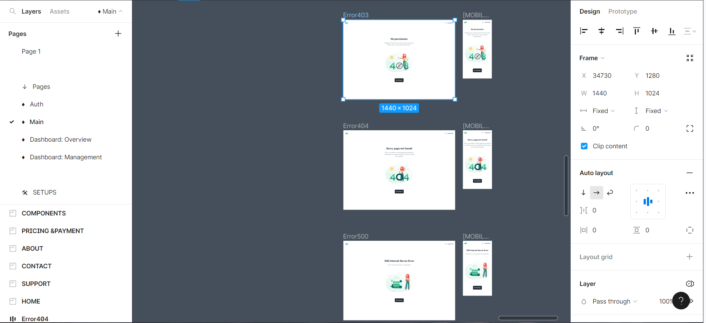
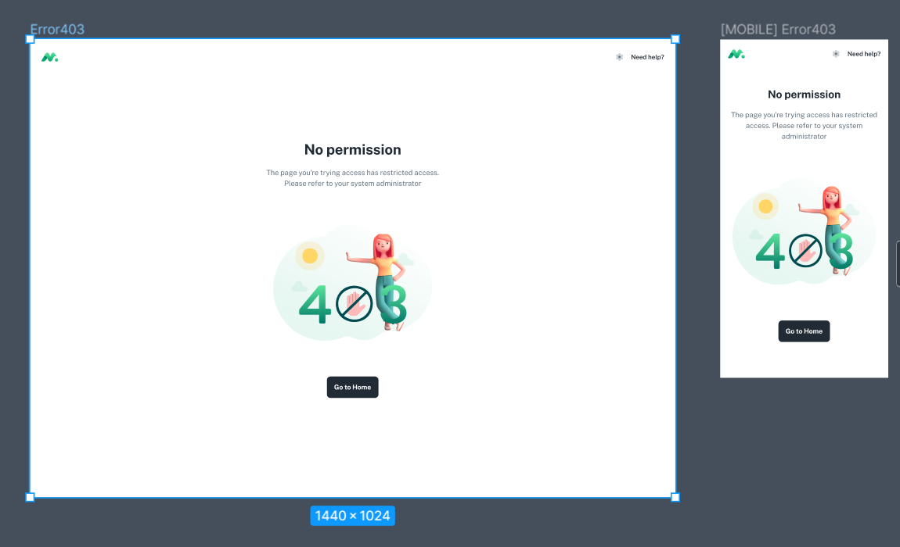
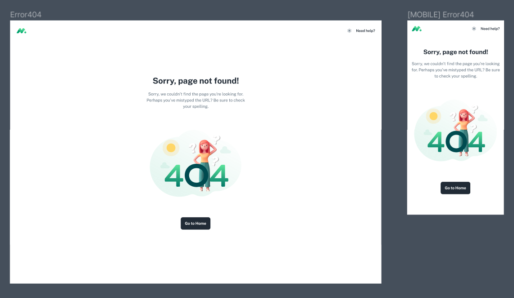
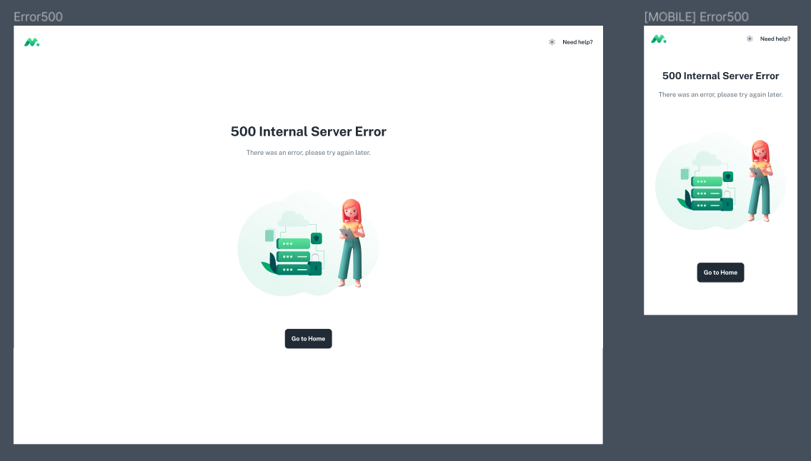
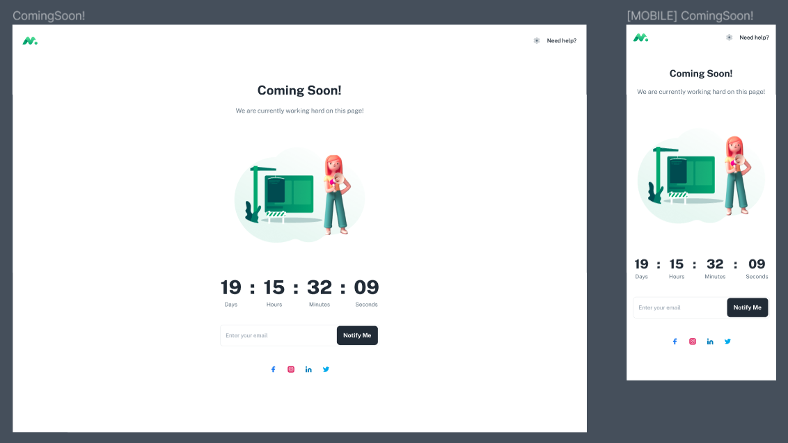
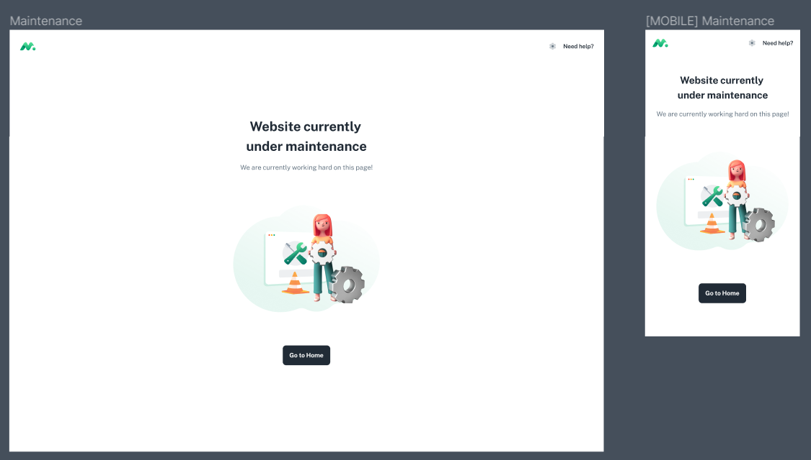

# PAGES OTHER MAIN

# *Content*

1. [Cấu trúc](#1) 
   1. [Figma](#1.1)
   2. [Phân tích Layout](#1.2)
2. [Link](#2)
3. [Routes](#3)
4. [Layout](#4)
5. [Pages](#5)


# Cấu trúc <a id="1"></a>
> Những video trước trong khóa học chúng ta cùng nhau làm phần layout cho trang Home trong main trong lần này chung ta tiếp tục đi hoàn thiện các trang khác trong dự án, có thể xem file thiết kế `Figma`, thì trong main có tổ hợp trang `Other` có thiết kế tương đồng có thể hoàn thiện trực tiếp.
## Figma <a id="1.1"></a>

## Phân tích Layout <a id="1.2"></a>
> Layout chung của các trang này sẽ là:  
* cùng có path trực tiếp từ `/path` tức là ngang cấp với trang `home` và không có trang con ở bên trong.
* cùng có 1 dạng `layout` chỉ có `header` ==> `compact` không giống như của trang `Home`.

> Gồm các trang:
* **Error**:
  * `403`: *Lỗi này xảy ra khi bạn không được phép truy cập trang web. Điều này có thể do bạn không có quyền truy cập hoặc trang web đang được bảo vệ bằng mật khẩu.*
  * `404`:  *Lỗi này xảy ra khi trang web mà bạn đang cố truy cập không tồn tại. Điều này có thể do trang web đã bị xóa, di chuyển hoặc có lỗi.*
  * `500`: *Lỗi này xảy ra khi máy chủ web gặp sự cố khi xử lý yêu cầu của bạn. Điều này có thể do nhiều nguyên nhân, chẳng hạn như lỗi phần mềm, lỗi phần cứng hoặc quá tải.*
* **Other**:
  * `maintemance`: *được sử dụng để thông báo cho người dùng rằng trang web chính đang được bảo trì. Trang web này thường được tạo ra bởi người quản trị web khi họ cần thực hiện các thay đổi đối với trang web chính, chẳng hạn như cập nhật phần mềm, sửa lỗi hoặc thêm nội dung mới.*
  * `coming soon`: *một trang web tạm thời được sử dụng để thông báo cho người dùng rằng một trang web hoặc sản phẩm mới sắp được ra mắt. Trang web này thường được sử dụng bởi các doanh nghiệp, tổ chức hoặc cá nhân khi họ đang trong quá trình phát triển một trang web hoặc sản phẩm mới.*

> Để tạo ra những trang này cần chú ý các mục cần tạo:
* `Link`: tạo đường dẫn vào trang pages ở đây sẽ dẫn qua `list` của `navigation` của trang `Home`.
* `Routes`: tạo các đường path đến trang, phần này sẽ phát triển trong `mainRoutes` cùng trong mục `Routes` đang phát triển.
* `Layout`: Không thể dùng layout của main chúng ta tạo ra một layout riêng trong mục `compact` rất đơn giản chỉ gồm có header.
* `Pages`: Tạo ra nội dung `view` của từng trang web.

# Link <a id="2"></a>
> Như đã phân tích ở trên thì chung ta sẽ bắt đầu từ code của layout trang home cụ thể là trong phần `header` của `main/nav/header`  thêm đường dẫn vào `main/nav/config-navigation`:
```tsx
    export const navConfig = [
  {
    title: 'Home',
    icon: <Iconify icon="solar:home-2-bold-duotone" />,
    path: '/',
  },
  {
    title: 'Components',
    icon: <Iconify icon="solar:atom-bold-duotone" />,
    path: paths.components,
  },
  {
    title: 'Pages',
    path: '/pages',
    icon: <Iconify icon="solar:file-bold-duotone" />,
    children: [
        // tạo list trong pages vậy là có thế sử dụng được
      {
        subheader: 'Other',
        items: [
          { title: 'About us', path: paths.about },
          { title: 'Contact us', path: paths.contact },
          { title: 'Maintenance', path: paths.maintenance },
          { title: 'Coming Soon', path: paths.comingSoon },
        ],
      }, 
      {
        subheader: 'Error',
        items: [
          { title: 'Page 403', path: paths.page403 },
          { title: 'Page 404', path: paths.page404 },
          { title: 'Page 500', path: paths.page500 },
        ],
      },
      {
        subheader: 'Dashboard',
        items: [{ title: 'Dashboard', path: PATH_AFTER_LOGIN }],
      },
    ],
  },
  {
    title: 'Docs',
    icon: <Iconify icon="solar:notebook-bold-duotone" />,
    path: paths.docs,
  },
];
```
> có đường đẫn rồi nhưng phải cho thêm vào `paths` dẫn đường:
```ts
    const ROOTS = {
  DASHBOARD: '/dashboard',
};

export const paths = {
  components: 'components',
  docs: 'docs',
  about: '/about-us',
  contact: '/contact-us',
  faqs: '/faqs',
  //other
  comingSoon: '/coming-soon',
  maintenance: '/maintenance',
  //error
  page403: '/403',
  page404: '/404',
  page500: '/500',
  //external
  changelog: 'https://google.com',
  minimalUI: 'https://google.com',

  //dashboard
  dashboard: {
    root: ROOTS.DASHBOARD,
  },
};
```
> Đến đây là có các lựa chọn dẫn nhưng chưa có đường dẫn thực tế nào vào chưa tồn tại một pages hiển thị nào cả
# Routes <a id="3"></a>
> cần thêm các lựa chọn vào trong file mainRouter
```ts
    {
    element: (
        //tạo compact trong mục layout
      <CompactLayout>
        <Suspense fallback={<SplashScreen />}>
          <Outlet />
        </Suspense>
      </CompactLayout>
    ),
    children: [
        //tạo pages 
      { path: 'coming-soon', element: <ComingSoonPage /> },
      { path: 'maintenance', element: <MaintenancePage /> },
      { path: '500', element: <Page500 /> },
      { path: '404', element: <Page404 /> },
      { path: '403', element: <Page403 /> },
    ],
  },
```
# Layout <a id="4"></a>
> tạo `CompastLayout` trong layouts/compact/layout.tsx
```tsx
    // @mui
import Stack from '@mui/material/Stack';
import Container from '@mui/material/Container';
//
import { HeaderSimple as Header } from '../_common';

// ----------------------------------------------------------------------

type Props = {
  children: React.ReactNode;
};

export default function CompactLayout({ children }: Props) {
  return (
    <>
      <Header />

      <Container component="main">
        <Stack
          sx={{
            py: 12,
            m: 'auto',
            maxWidth: 400,
            minHeight: '100vh',
            textAlign: 'center',
            justifyContent: 'center',
          }}
        >
          {children}
        </Stack>
      </Container>
    </>
  );
}
```
> tạo `Header` trong thư mục `./_common/header-simple`
```tsx
    return (
    <AppBar>
      <Toolbar
        sx={{
          justifyContent: 'space-between',
          height: {
            xs: HEADER.H_MOBILE,
            md: HEADER.H_DESKTOP,
          },
          transition: theme.transitions.create(['height'], {
            easing: theme.transitions.easing.easeInOut,
            duration: theme.transitions.duration.shorter,
          }),
          ...(offsetTop && {
            ...bgBlur({
              color: theme.palette.background.default,
            }),
            height: {
              md: HEADER.H_DESKTOP_OFFSET,
            },
          }),
        }}
      >
        <Logo />

        <Stack direction="row" alignItems="center" spacing={1}>
          <SettingsButton />

          <Link
            href={paths.faqs}
            component={RouterLink}
            color="inherit"
            sx={{ typography: 'subtitle2' }}
          >
            Need help?
          </Link>
        </Stack>
      </Toolbar>

      {offsetTop && <HeaderShadow />}
    </AppBar>
  );
}
```

# Pages <a id="5"></a>

1. ***Error*** 
   1. *Page 403*
    
> Pages (src/pages/403.tsx)

```tsx
    import { Helmet } from 'react-helmet-async';
    // sections
    import { View403 } from 'src/sections/error';

    // ----------------------------------------------------------------------

    export default function Page403() {
    return (
        <>
        <Helmet>
            <title> 403 Forbidden</title>
        </Helmet>

        <View403 />
        </>
    );
    }
```
> 403-view (src/sections/error/...)
```tsx
  import { m } from 'framer-motion';
// @mui
import Button from '@mui/material/Button';
import Typography from '@mui/material/Typography';
// assets
import { ForbiddenIllustration } from 'src/assets/illustrations';
// components
import { RouterLink } from 'src/routes/components';
import { MotionContainer, varBounce } from 'src/components/animate';

// ----------------------------------------------------------------------

export default function View403() {
  return (
    //tạo animations
    <MotionContainer>
      <m.div variants={varBounce().in}>
        <Typography variant="h3" sx={{ mb: 2 }}>
          No permission
        </Typography>
      </m.div>

      <m.div variants={varBounce().in}>
        <Typography sx={{ color: 'text.secondary' }}>
          The page you&apos;re trying access has restricted access.
          <br />
          Please refer to your system administrator
        </Typography>
      </m.div>

      <m.div variants={varBounce().in}>
        <ForbiddenIllustration sx={{ height: 260, my: { xs: 5, sm: 10 } }} />
      </m.div>

      <Button component={RouterLink} href="/" size="large" variant="contained">
        Go to Home
      </Button>
    </MotionContainer>
  );
} 
```  

   2. *Page 404*: tuong tự như trong 403
    
   3. *Page 500*: tuong tự như trong 403
        

2.***Other***
   1. *Coming Soon*
   
> Pages Coming Soon (./src/pages/comingSoon)

```tsx
        import { Helmet } from 'react-helmet-async';
        // sections
        import ComingSoonView from 'src/sections/coming-soon/view';

        // ----------------------------------------------------------------------

        export default function ComingSoonPage() {
        return (
            <>
            <Helmet>
                <title> Coming Soon</title>
            </Helmet>

            <ComingSoonView />
            </>
        );
        }
```

> Maintenance-view (./src/pages/Maintenance)
```tsx
    // @mui
import { alpha } from '@mui/material/styles';
import Box from '@mui/material/Box';
import Stack from '@mui/material/Stack';
import Button from '@mui/material/Button';
import TextField from '@mui/material/TextField';
import IconButton from '@mui/material/IconButton';
import Typography from '@mui/material/Typography';
import InputAdornment from '@mui/material/InputAdornment';
import { outlinedInputClasses } from '@mui/material/OutlinedInput';
// hooks
import { useCountdownDate } from 'src/hooks/use-countdown';
// _mock
import { _socials } from 'src/_mock';
// assets
import { ComingSoonIllustration } from 'src/assets/illustrations';
// components
import Iconify from 'src/components/iconify';

// ----------------------------------------------------------------------

export default function ComingSoonView() {
  const { days, hours, minutes, seconds } = useCountdownDate(new Date('07/07/2024 21:30'));

  return (
    <>
      <Typography variant="h3" sx={{ mb: 2 }}>
        Coming Soon!
      </Typography>

      <Typography sx={{ color: 'text.secondary' }}>
        We are currently working hard on this page!
      </Typography>

      <ComingSoonIllustration sx={{ my: 10, height: 240 }} />

      <Stack
        direction="row"
        justifyContent="center"
        divider={<Box sx={{ mx: { xs: 1, sm: 2.5 } }}>:</Box>}
        sx={{ typography: 'h2' }}
      >
        <TimeBlock label="Days" value={days} />

        <TimeBlock label="Hours" value={hours} />

        <TimeBlock label="Minutes" value={minutes} />

        <TimeBlock label="Seconds" value={seconds} />
      </Stack>

      <TextField
        fullWidth
        placeholder="Enter your email"
        InputProps={{
          endAdornment: (
            <InputAdornment position="end">
              <Button variant="contained" size="large">
                Notify Me
              </Button>
            </InputAdornment>
          ),
          sx: {
            pr: 0.5,
            [`&.${outlinedInputClasses.focused}`]: {
              boxShadow: (theme) => theme.customShadows.z20,
              transition: (theme) =>
                theme.transitions.create(['box-shadow'], {
                  duration: theme.transitions.duration.shorter,
                }),
              [`& .${outlinedInputClasses.notchedOutline}`]: {
                border: (theme) => `solid 1px ${alpha(theme.palette.grey[500], 0.32)}`,
              },
            },
          },
        }}
        sx={{ my: 5 }}
      />

      <Stack spacing={1} alignItems="center" justifyContent="center" direction="row">
        {_socials.map((social) => (
          <IconButton
            key={social.name}
            sx={{
              color: social.color,
              '&:hover': {
                bgcolor: alpha(social.color, 0.08),
              },
            }}
          >
            <Iconify icon={social.icon} />
          </IconButton>
        ))}
      </Stack>
    </>
  );
}

// ----------------------------------------------------------------------

type TimeBlockProps = {
  label: string;
  value: string;
};

function TimeBlock({ label, value }: TimeBlockProps) {
  return (
    <div>
      <Box> {value} </Box>
      <Box sx={{ color: 'text.secondary', typography: 'body1' }}>{label}</Box>
    </div>
  );
}

```
   1. *Maintenance*: Xây dựng tương tự như trên
       
    
# Bổ sung
  1. Animation Container 

> dùng để tạo hiệu ứng container trên trang khi mới mở ra   

> Tạo file `motion-container` (src/components/animate/...)
```tsx
  import { m, MotionProps } from 'framer-motion';
// @mui
import Box, { BoxProps } from '@mui/material/Box';
//
import { varContainer } from './variants';

// ----------------------------------------------------------------------

type IProps = BoxProps & MotionProps;

export interface Props extends IProps {
  animate?: boolean;
  action?: boolean;
}

export default function MotionContainer({ animate, action = false, children, ...other }: Props) {
  if (action) {
    return (
      <Box
        component={m.div}
        initial={false}
        animate={animate ? 'animate' : 'exit'}
        variants={varContainer()}
        {...other}
      >
        {children}
      </Box>
    );
  }

  return (
    <Box
      component={m.div}
      initial="initial"
      animate="animate"
      exit="exit"
      variants={varContainer()}
      {...other}
    >
      {children}
    </Box>
  );
}

```
>Tiếp theo, thành phần định nghĩa giao diện thuộc tính của nó. Giao diện IProps định nghĩa các thuộc tính chung cho cả phiên bản action và non-action của thành phần. Giao diện Props mở rộng giao diện IProps và thêm các thuộc tính animate và action.

>Thành phần sau đó triển khai hai phiên bản khác nhau của chính nó: một cho các phần tử action và một cho các phần tử non-action. Phiên bản action của thành phần đặt trạng thái ban đầu của nó thành false và hoạt ảnh các thành phần con của nó giữa các biến thể animate và exit. Phiên bản non-action của thành phần đặt trạng thái ban đầu của nó thành initial và hoạt ảnh các thành phần con của nó giữa các biến thể initial, animate và exit.

>Cuối cùng, thành phần trả về phiên bản thích hợp của chính nó dựa trên thuộc tính action.
> Tạo biến Container:
```tsx
  // ----------------------------------------------------------------------

export type Props = {
  staggerIn?: number;
  delayIn?: number;
  staggerOut?: number;
};

export const varContainer = (props?: Props) => {
  const staggerIn = props?.staggerIn || 0.05;
  const delayIn = props?.staggerIn || 0.05;
  const staggerOut = props?.staggerIn || 0.05;

  return {
    animate: {
      transition: {
        staggerChildren: staggerIn,
        delayChildren: delayIn,
      },
    },
    exit: {
      transition: {
        staggerChildren: staggerOut,
        staggerDirection: -1,
      },
    },
  };
};

```
>Bộ code bạn cung cấp là một mô-đun React tùy chỉnh có tên là `varContainer`. Nó xuất một hàm nhận đối tượng Props tùy chọn làm đầu vào và trả về một đối tượng chứa các biến thể hoạt ảnh.

>Đối tượng Props có các thuộc tính sau:

* `staggerIn`: Số giây để làm chậm hoạt ảnh của các thành phần con của container khi chúng nhập. Mặc định là 0.05.
* `delayIn`: Số giây để trì hoãn hoạt ảnh của các thành phần con của container khi chúng nhập. Mặc định là 0.05.
* `staggerOut`: Số giây để làm chậm hoạt ảnh của các thành phần con của container khi chúng thoát. Mặc định là 0.05.
Hàm varContainer trả về một đối tượng chứa hai biến thể hoạt ảnh: animate và exit.

>Biến thể animate có các thuộc tính sau:

* `transition`: Một đối tượng chứa các tùy chọn chuyển đổi cho hoạt ảnh.
* `staggerChildren`: Số giây để làm chậm hoạt ảnh của các thành phần con của container khi chúng nhập. Mặc định là giá trị của thuộc tính staggerIn.
* `delayChildren`: Số giây để trì hoãn hoạt ảnh của các thành phần con của container khi chúng nhập. Mặc định là giá trị của thuộc tính delayIn.
>Biến thể exit có các thuộc tính sau:

* `transition`: Một đối tượng chứa các tùy chọn chuyển đổi cho hoạt ảnh.
* `staggerChildren`: Số giây để làm chậm hoạt ảnh của các thành phần con của container khi chúng thoát. Mặc định là giá trị của thuộc tính staggerOut.
* `staggerDirection`: Một số chỉ định hướng mà các thành phần con nên được làm chậm. Mặc định là 1, có nghĩa là các thành phần con sẽ được làm chậm từ đầu đến cuối. Giá trị -1 sẽ khiến các thành phần con được làm chậm từ cuối đến đầu.
2. `Illustration` *(src/assets/illustrations)*
   1. Maintenance
   > tạo ra hình ảnh nhờ file `SVG`
 ```tsx
  import { memo } from 'react';
// @mui
import { useTheme } from '@mui/material/styles';
import Box, { BoxProps } from '@mui/material/Box';
//
import BackgroundShape from './background-shape';

// ----------------------------------------------------------------------

function MaintenanceIllustration({ ...other }: BoxProps) {
  const theme = useTheme();

  const PRIMARY_LIGHT = theme.palette.primary.light;

  const PRIMARY_MAIN = theme.palette.primary.main;

  const PRIMARY_DARK = theme.palette.primary.dark;

  const PRIMARY_DARKER = theme.palette.primary.darker;

  return (
    <Box
      component="svg"
      width="100%"
      height="100%"
      viewBox="0 0 480 360"
      xmlns="http://www.w3.org/2000/svg"
      {...other}
    >
      <BackgroundShape />

      <path
        fill={PRIMARY_MAIN}
        d="M297.46 99.296l-185.934-5.29c-6.35-.18-11.526 4.158-11.526 9.693v159.882c0 5.534 5.176 9.742 11.526 9.4l185.934-10.028c5.28-.284 9.54-4.576 9.54-9.585v-144.73c0-5.012-4.26-9.194-9.54-9.342z"
        opacity="0.12"
      />

      <path
        fill="#fff"
        d="M297.476 93.405l-180.3-5.278c-6.157-.18-11.176 4.15-11.176 9.67v159.496c0 5.521 5.019 9.718 11.176 9.377l180.3-10.003c5.12-.284 9.251-4.565 9.251-9.563v-144.38c0-5-4.131-9.172-9.251-9.32z"
      />

      <g fill="#919EAB" opacity="0.16">
        <path d="M205.131 203.668a44.088 44.088 0 01-20.975-4.875 42.576 42.576 0 01-16.793-15.549 40.54 40.54 0 01-5.98-21.153c0-23.36 19.874-41.848 43.748-41.227 23.283.606 41.804 19.248 41.804 41.569 0 22.322-18.521 40.816-41.804 41.235zM266.304 235.213a4.461 4.461 0 01-4.271 4.417l-106.87 4.074c-2.652.107-4.808-1.842-4.808-4.341v-16.97c0-2.499 2.156-4.579 4.808-4.644l106.87-2.64a4.142 4.142 0 013.018 1.168 4.128 4.128 0 011.253 2.98v15.956z" />
      </g>

      <path
        fill="#C4CDD5"
        d="M186.797 136.682a1.812 1.812 0 01-.525 1.378l-1.858 1.858 16.887 16.893a2.174 2.174 0 01-3.074 3.074l-16.886-16.892-1.859 1.859a1.803 1.803 0 01-2.685-.157l-7.916-9.615a1.8 1.8 0 01.14-2.392l5.091-5.093a1.8 1.8 0 012.392-.14l9.612 7.917c.404.32.651.797.681 1.31zM209.727 165.24l5.441 5.443a2.174 2.174 0 01-3.074 3.075l-5.441-5.443a2.175 2.175 0 013.074-3.075z"
      />

      <path
        fill="#F4F6F8"
        d="M209.727 165.24l5.441 5.443a2.176 2.176 0 010 3.075l-8.515-8.518a2.172 2.172 0 013.074 0z"
      />

      <path
        fill="url(#paint0_linear_1_160)"
        d="M238.581 194.781l-2.399 2.399c-3.425 3.431-9.046 3.315-12.32-.318l-16.564-18.475a2.176 2.176 0 01.081-2.989l9.309-9.313a2.174 2.174 0 012.978-.091l18.552 16.422.004.004c3.646 3.243 3.812 8.907.359 12.361z"
      />

      <path
        fill="url(#paint1_linear_1_160)"
        d="M240.711 138.762c-.332-1.582-2.287-2.165-3.429-1.021l-7.117 7.12a3.31 3.31 0 01-4.681 0l-3.813-3.815a3.308 3.308 0 010-4.68l7.117-7.122c1.143-1.142.561-3.098-1.02-3.43-5.355-1.126-11.157.392-15.316 4.552-5.296 5.299-6.308 13.259-3.037 19.573l-40.33 33.142a5.766 5.766 0 00-.516 8.61l6.289 6.291a5.761 5.761 0 008.607-.516l33.13-40.345c6.312 3.272 14.268 2.26 19.566-3.038 4.159-4.16 5.675-9.964 4.55-15.321zm-61.338 50.587a2.174 2.174 0 110-4.349 2.174 2.174 0 010 4.349z"
      />

      <path
        fill="#919EAB"
        d="M186.797 136.682a1.812 1.812 0 01-.525 1.378l-1.858 1.858 16.887 16.893a2.174 2.174 0 010 3.074l-29.734-29.744 2.545-2.546a1.8 1.8 0 012.391-.14l9.613 7.917c.404.32.651.797.681 1.31z"
      />

      <path
        fill={PRIMARY_DARKER}
        d="M238.581 194.781l-1.199 1.199-25.289-25.298 4.595-4.597a2.173 2.173 0 012.977-.091l18.553 16.422.004.004c3.645 3.243 3.812 8.907.359 12.361z"
        opacity="0.24"
      />

      <path
        fill={PRIMARY_DARKER}
        d="M236.161 154.083c-5.298 5.298-13.254 6.31-19.566 3.038l-33.13 40.345a5.761 5.761 0 01-8.607.516l-3.145-3.145 6.122-6.125a2.174 2.174 0 103.075-3.076l42.668-42.682 1.907 1.907a3.308 3.308 0 004.68 0l7.117-7.12c1.142-1.144 3.097-.561 3.429 1.021 1.125 5.357-.392 11.161-4.55 15.321z"
        opacity="0.24"
      />

      <path
        fill="url(#paint2_linear_1_160)"
        d="M249.706 290.362v3.306c0 .847-.436 1.546-1.011 1.622l-51.671 4.676a3.72 3.72 0 01-1.448-.087l-36.003-6.775c-.382-.1-.664-.6-.664-1.177v-3.494l38.198-4.727 4.917-2.324 4.889.703 2.887-.552 6.599 1.917 33.307 6.912z"
      />

      <path
        fill="url(#paint3_linear_1_160)"
        d="M249.707 290.362v3.307c0 .846-.436 1.545-1.012 1.621l-51.668 4.676a3.684 3.684 0 01-1.148-.024v-17.813l6.148-.749 4.889.703 2.886-.552 6.598 1.917 33.307 6.914z"
        opacity="0.3"
      />

      <path
        fill="url(#paint4_linear_1_160)"
        d="M209.803 281.53l-50.89 6.74 36.707 6.904c.445.115.909.142 1.366.08l52.72-4.892-39.903-8.832z"
      />

      <path
        fill="url(#paint5_linear_1_160)"
        d="M228.459 287.623c0 2.42-7.627 4.302-18.157 4.79-2.657.121-5.499.156-8.447.088-14.491-.333-26.135-3.025-26.135-6.005a.81.81 0 01.02-.214h-.02l.06-.143a.834.834 0 01.054-.139l3.342-8.724 4.037-10.526 5.652-14.753 4.325-11.293 5.381-14.042c.673-1.758 1.922-2.851 3.269-2.851.183-.001.364.019.542.059 1.138.248 2.153 1.272 2.737 2.795l5.427 14.14 4.337 11.441 5.715 15.05 4.106 10.813.065.006 3.42 8.787c.147.239.27.479.27.721z"
      />

      <path
        fill="#fff"
        d="M224.769 278.12c-3.299 1.101-8.572 1.894-14.893 2.188-2.545.12-5.237.159-8.037.107-9.736-.184-18.178-1.434-22.67-3.137l4.039-10.527c4.728 1.062 11.316 1.778 18.644 1.888 2.368.036 4.676.006 6.874-.083 4.623-.183 8.7-.626 11.913-1.255l4.071 10.812.059.007zM214.93 252.246c-2.519.272-5.287.457-8.225.54-1.573.046-3.194.063-4.849.046a112.824 112.824 0 01-12.991-.835l4.326-11.293c2.707.214 5.623.336 8.665.353 1.071.006 2.129-.001 3.172-.022 1.907-.036 3.751-.112 5.519-.23l4.383 11.441z"
      />

      <path
        fill="url(#paint6_linear_1_160)"
        d="M210.302 292.411c-2.657.122-5.499.157-8.447.089-14.491-.334-26.135-3.025-26.135-6.005a.81.81 0 01.02-.214h-.02l.06-.143a.834.834 0 01.054-.139l3.342-8.724 4.037-10.526 5.652-14.752 4.325-11.293 5.381-14.042c.673-1.758 1.922-2.851 3.269-2.851.183-.001.364.019.542.059.574 3.574 1.558 9.812 2.646 17.165.546 3.702 1.118 7.687 1.677 11.753a776.568 776.568 0 012.016 15.767c.485 4.188.899 8.185 1.192 11.754.429 5.167.604 9.441.389 12.102z"
        opacity="0.2"
      />

      <path fill="#FF5630" d="M118.108 103.182a2.5 2.5 0 100-5 2.5 2.5 0 000 5z" />

      <path fill="#FFAB00" d="M126.108 103.182a2.5 2.5 0 100-5 2.5 2.5 0 000 5z" />

      <path fill="#36B37E" d="M134.108 103.182a2.5 2.5 0 100-5 2.5 2.5 0 000 5z" />

      <defs>
        <linearGradient
          id="paint0_linear_1_160"
          x1="166.881"
          x2="166.881"
          y1="125.454"
          y2="199.671"
          gradientUnits="userSpaceOnUse"
        >
          <stop stopColor={PRIMARY_LIGHT} />
          <stop offset="1" stopColor={PRIMARY_DARK} />
        </linearGradient>

        <linearGradient
          id="paint1_linear_1_160"
          x1="166.881"
          x2="166.881"
          y1="125.454"
          y2="199.671"
          gradientUnits="userSpaceOnUse"
        >
          <stop stopColor={PRIMARY_LIGHT} />
          <stop offset="1" stopColor={PRIMARY_DARK} />
        </linearGradient>

        <linearGradient
          id="paint2_linear_1_160"
          x1="158.912"
          x2="249.709"
          y1="290.69"
          y2="290.69"
          gradientUnits="userSpaceOnUse"
        >
          <stop stopColor="#FFC444" />
          <stop offset="1" stopColor="#F36F56" />
        </linearGradient>

        <linearGradient
          id="paint3_linear_1_160"
          x1="226.725"
          x2="225.966"
          y1="290.498"
          y2="292.586"
          gradientUnits="userSpaceOnUse"
        >
          <stop stopColor="#FFC444" />
          <stop offset="0.59" stopColor="#F8924F" />
          <stop offset="1" stopColor="#F36F56" />
        </linearGradient>

        <linearGradient
          id="paint4_linear_1_160"
          x1="210.87"
          x2="210.566"
          y1="288.399"
          y2="289.237"
          gradientUnits="userSpaceOnUse"
        >
          <stop stopColor="#FFC444" />
          <stop offset="0.59" stopColor="#F8924F" />
          <stop offset="1" stopColor="#F36F56" />
        </linearGradient>

        <linearGradient
          id="paint5_linear_1_160"
          x1="202.974"
          x2="199.672"
          y1="204.073"
          y2="311.415"
          gradientUnits="userSpaceOnUse"
        >
          <stop stopColor="#FFC444" />
          <stop offset="1" stopColor="#F36F56" />
        </linearGradient>

        <linearGradient
          id="paint6_linear_1_160"
          x1="175.72"
          x2="210.394"
          y1="258.172"
          y2="258.172"
          gradientUnits="userSpaceOnUse"
        >
          <stop stopColor="#FFC444" />
          <stop offset="1" stopColor="#F36F56" />
        </linearGradient>
      </defs>

      <image href="/assets/illustrations/characters/character_5.png" height="300" x="245" y="30" />
    </Box>
  );
}

export default memo(MaintenanceIllustration);
   
 ```
 >Xem thêm BackgroundShape
```tsx
  import { memo } from 'react';
// @mui
import { useTheme } from '@mui/material/styles';

// ----------------------------------------------------------------------

function BackgroundShape() {
  const theme = useTheme();

  const PRIMARY_MAIN = theme.palette.primary.main;

  // Tạo một gradient tuyến tính với màu PRIMARY_MAIN ở đầu và trong suốt ở cuối

  const gradient = `url(#BG)`;

  // Tạo một path element với hình dạng mong muốn
  //Thành phần sau đó vẽ một path element với thuộc tính fill được đặt thành gradient tuyến tính url(#BG). Thuộc tính d của path element định nghĩa hình dạng của hình dạng nền.
  const path = (
    <path
      fill={gradient}
      fillRule="nonzero"
      d="M0 198.78c0 41.458 14.945 79.236 39.539 107.786 28.214 32.765 69.128 53.365 114.734 53.434a148.44 148.44 0 0056.495-11.036c9.051-3.699 19.182-3.274 27.948 1.107a75.779 75.779 0 0033.957 8.01c5.023 0 9.942-.494 14.7-1.433 13.58-2.67 25.94-8.99 36.09-17.94 6.378-5.627 14.547-8.456 22.897-8.446h.142c27.589 0 53.215-8.732 74.492-23.696 19.021-13.36 34.554-31.696 44.904-53.224C474.92 234.58 480 213.388 480 190.958c0-76.93-59.774-139.305-133.498-139.305-7.516 0-14.88.663-22.063 1.899C305.418 21.42 271.355 0 232.499 0a103.651 103.651 0 00-45.88 10.661c-13.24 6.487-25.011 15.705-34.64 26.939-32.698.544-62.931 11.69-87.676 30.291C25.351 97.155 0 144.882 0 198.781z"
    ></path>
  );

  // Trả về path element

  return path;
}

export default memo(BackgroundShape);
```
   2. Coming soon
   3. Error 500
   4. Error 403
   5. Error 404